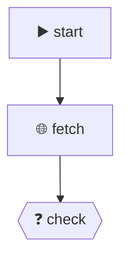

# ClawFlow v4.0 - 增强工作流引擎

> 从 n8n 架构原理实现的 Python 工作流引擎，支持 **18种节点** 和 **高价值增强功能**。

## ✨ 高价值功能 (v4.0 新增)

### 1. 工作流可视化 ⭐
```python
engine = WorkflowEngine()

# 生成 Mermaid 流程图
mermaid = engine.visualize(workflow, format="mermaid")
print(mermaid)
```

输出:


### 2. 条件分支路由追踪 ⭐
```python
result = engine.execute(workflow)
print(result.branches_taken)  # ['check:True', 'grade:B']
```

### 3. OpenClaw Cron 集成 ⭐⭐
```python
# 配置定时任务
engine.schedule(
    workflow=workflow,
    cron_expr="0 9 * * *",  # 每天9点
    name="daily_report",
    channel="telegram"
)
```

### 4. Webhook 触发器 ⭐⭐
```python
# 启动 HTTP 服务器
engine.serve(workflow, port=8080)

# 外部触发: POST http://localhost:8080/webhook/my-workflow
```

### 5. 并行执行 (v3.0)
```python
# 自动识别可并行节点
result = engine.execute(workflow, parallel=True)
# 速度提升: 2-5x
```

---

## 🚀 快速开始

```python
from clawflow import WorkflowEngine

workflow = {
    "name": "数据处理",
    "nodes": [
        {"id": "start", "type": "trigger", "params": {}},
        {"id": "process", "type": "function", "params": {
            "code": "output = {'result': input['text'].upper()}"
        }},
        {"id": "output", "type": "output", "params": {}}
    ],
    "connections": [
        {"from": "start", "to": "process"},
        {"from": "process", "to": "output"}
    ]
}

engine = WorkflowEngine()
result = engine.execute(workflow, input_data={"text": "hello"})
print(result.data)  # {'result': 'HELLO'}
```

---

## 📦 节点类型 (18种)

### 基础节点
| 节点 | 功能 |
|------|------|
| `trigger` | 工作流触发器 |
| `function` | Python 代码执行 |
| `output` | 输出/打印/保存 |
| `http` | HTTP 请求 |
| `if` | 条件分支 ❓ |
| `merge` | 数据合并 🔀 |
| `delay` | 延迟执行 |
| `transform` | 映射/过滤/排序 |

### 数据节点
| 节点 | 功能 |
|------|------|
| `file` | 文件读写/列表 📁 |
| `csv` | CSV 处理 📊 |
| `json` | JSON 处理 📋 |
| `database` | SQLite 操作 🗄️ |

### 集成节点
| 节点 | 功能 |
|------|------|
| `llm` | 大模型调用 🤖 |
| `email` | 邮件发送 📧 |
| `cron` | 定时配置 📅 |
| `skill` | OpenClaw Skill 调用 🔧 |
| `message` | 消息发送 💬 |

---

## 💡 使用示例

### 示例 1: 数据管道 + 可视化
```python
workflow = {
    "name": "CSV处理管道",
    "nodes": [
        {"id": "read", "type": "csv", "params": {
            "operation": "read", 
            "path": "input.csv"
        }},
        {"id": "filter", "type": "transform", "params": {
            "operation": "filter", 
            "field": "status", 
            "value": "active"
        }},
        {"id": "sort", "type": "transform", "params": {
            "operation": "sort", 
            "field": "score", 
            "reverse": True
        }},
        {"id": "save", "type": "json", "params": {
            "operation": "write", 
            "path": "output.json"
        }}
    ],
    "connections": [
        {"from": "read", "to": "filter"},
        {"from": "filter", "to": "sort"},
        {"from": "sort", "to": "save"}
    ]
}

engine = WorkflowEngine()

# 可视化
print(engine.visualize(workflow, format="mermaid"))

# 执行
result = engine.execute(workflow, verbose=True)
```

### 示例 2: 条件分支
```python
workflow = {
    "name": "成绩判断",
    "nodes": [
        {"id": "input", "type": "function", "params": {
            "code": "output = {'score': 85}"
        }},
        {"id": "check", "type": "if", "params": {
            "condition": "json.get('score', 0) >= 60"
        }},
        {"id": "pass", "type": "message", "params": {
            "channel": "telegram",
            "message": "通过！"
        }},
        {"id": "fail", "type": "message", "params": {
            "channel": "telegram", 
            "message": "未通过！"
        }},
    ],
    "connections": [
        {"from": "input", "to": "check"},
        {"from": "check", "to": "pass"},
        {"from": "check", "to": "fail"},
    ]
}

result = engine.execute(workflow)
print(f"分支走向: {result.branches_taken}")  # ['check:True']
```

### 示例 3: OpenClaw Skill 调用
```python
workflow = {
    "name": "搜索+处理",
    "nodes": [
        {
            "id": "search",
            "type": "skill",
            "params": {
                "skill": "web_search",
                "params": {"query": "Python asyncio"}
            }
        },
        {
            "id": "process",
            "type": "function",
            "params": {
                "code": """
results = input.get('results', [])
output = {
    "titles": [r['title'] for r in results[:5]],
    "count": len(results)
}
"""
            }
        }
    ],
    "connections": [
        {"from": "search", "to": "process"}
    ]
}
```

### 示例 4: 定时任务
```python
workflow = {
    "name": "日报",
    "nodes": [
        {"id": "report", "type": "function", "params": {
            "code": "output = {'summary': '今日数据...'}"
        }},
        {"id": "send", "type": "message", "params": {
            "channel": "telegram",
            "message": "日报: {{summary}}"
        }}
    ],
    "connections": [{"from": "report", "to": "send"}]
}

# 每天早上9点执行
engine.schedule(workflow, cron_expr="0 9 * * *", name="daily_report")
```

### 示例 5: Webhook 触发
```python
# 定义工作流
workflow = {
    "name": "Webhook处理",
    "nodes": [
        {"id": "receive", "type": "trigger", "params": {}},
        {"id": "process", "type": "function", "params": {
            "code": "output = {'received': input}"
        }},
        {"id": "notify", "type": "message", "params": {
            "channel": "telegram",
            "message": "收到数据"
        }}
    ],
    "connections": [
        {"from": "receive", "to": "process"},
        {"from": "process", "to": "notify"}
    ]
}

# 启动服务器
engine.serve(workflow, port=8080)

# 外部调用:
# curl -X POST http://localhost:8080/webhook/my-workflow \
#      -H "Content-Type: application/json" \
#      -d '{"event": "user_signup"}'
```

---

## 📊 版本演进

| 版本 | 日期 | 核心特性 |
|------|------|----------|
| v1.0 | 2026-03-13 | 基础引擎：8节点 |
| v2.0 | 2026-03-13 | 扩展：16节点 + 验证/日志/重试 |
| v3.0 | 2026-03-13 | 并行执行 + OpenClaw集成 |
| **v4.0** | 2026-03-13 | **可视化 + 条件分支 + Cron + Webhook** |

---

## 📂 文件结构

```
clawflow/
├── __init__.py           # 包入口
├── engine.py             # 执行引擎 (可视化/Cron/Webhook)
├── nodes.py              # 18种节点实现
├── examples.py           # 基础示例
├── examples_v3.py        # 并行示例
├── test_v3.py            # 功能测试
├── test_v4.py            # 高价值功能测试 ⭐NEW
└── README.md             # 本文档
```

---

## 🔧 高级功能

### 并行执行
```python
# 自动识别无依赖节点并行执行
result = engine.execute(workflow, parallel=True)
print(f"速度提升: {result.parallel_stats}")
```

### 错误重试
```python
# 失败自动重试3次
result = engine.execute(workflow, max_retries=3)
```

### 工作流持久化
```python
# 保存工作流
engine.save_workflow(workflow, "my_workflow.json")

# 加载工作流
workflow = engine.load_workflow("my_workflow.json")
```

### 表达式系统
```python
# 在节点参数中使用表达式
{
    "id": "process",
    "type": "function",
    "params": {
        "code": "output = $input.data",           # 访问输入
        "url": "$node.fetch.result.url",        # 访问其他节点输出
        "name": "$var.user_name"                 # 访问变量
    }
}
```

---

## 🎯 适用场景

- ✅ 数据 ETL 管道
- ✅ 自动化工作流
- ✅ API 聚合/编排
- ✅ 定时任务
- ✅ Webhook 处理
- ✅ 消息通知
- ✅ AI 处理链

---

## 🔄 下一步计划

- [ ] 节点结果缓存
- [ ] 调试能力 (断点/单步)
- [ ] Web 可视化编辑器
- [ ] 更多数据库支持 (PostgreSQL/MySQL)
- [ ] 分布式执行

---

**ClawFlow - 让工作流像写代码一样简单。**
