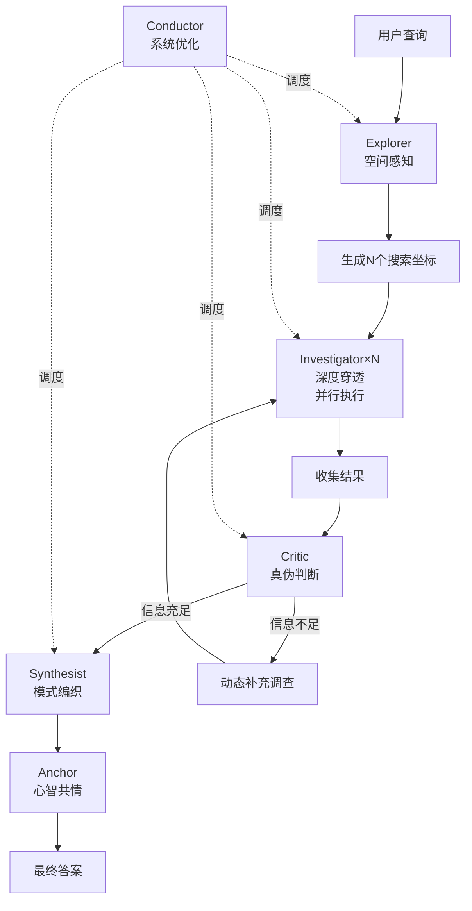

# OCA-MAS 详细文档
# OpenClaw Adaptive Multi-Agent System

## 📚 目录

1. [架构概述](#架构概述)
2. [核心概念](#核心概念)
3. [快速开始](#快速开始)
4. [API 参考](#api-参考)
5. [测试指南](#测试指南)
6. [集成指南](#集成指南)
7. [故障排除](#故障排除)

---

## 架构概述

### 系统架构图

```
┌─────────────────────────────────────────────────────────────────┐
│                        User Interface                            │
│                     (OpenClaw / CLI / API)                      │
└─────────────────────────────────────────────────────────────────┘
                              ↓
┌─────────────────────────────────────────────────────────────────┐
│                    Conductor (Orchestrator)                      │
│  职责: 系统优化力 (System Optimization)                          │
│  功能: • 关键路径分析                                            │
│       • 动态资源调度                                             │
│       • 任务分解与依赖管理                                        │
└─────────────────────────────────────────────────────────────────┘
                              ↓
        ┌─────────────────────┼─────────────────────┐
        ↓                     ↓                     ↓
┌──────────────┐    ┌──────────────┐    ┌──────────────┐
│   Explorer   │───→│ Investigator │───→│    Critic    │
│  (空间感知力) │    │  (深度穿透力) │    │  (真伪判断力) │
│              │    │              │    │              │
│ 输入: Query  │    │ 并行×N 实例  │    │ 输出: 通过/   │
│ 输出: 搜索   │    │ 动态创建     │    │      不通过   │
│      坐标    │    │              │    │      + 缺口   │
└──────────────┘    └──────────────┘    └──────┬───────┘
                                                │
                    ┌───────────────────────────┘
                    ↓ (如需补充)
        ┌───────────────────────────┐
        │  动态补充调查              │
        │  (Kimi风格动态任务创建)     │
        └───────────────────────────┘
                    ↓
        ┌───────────────────────────┐
        │   Synthesist              │
        │  (模式编织力)              │
        │                           │
        │  输入: 所有调查结果         │
        │  输出: 综合答案+洞察        │
        └─────────────┬─────────────┘
                      ↓
        ┌───────────────────────────┐
        │      Anchor               │
        │   (心智共情力)             │
        │                           │
        │  调整输出格式              │
        │  确保用户理解              │
        └───────────────────────────┘
```

### 工作流程



---

## 核心概念

### 1. 第一性原理设计

每个智能体的设计基于一个不可再分的基本事实：

| 智能体 | 第一性原理 | 核心超能力 |
|--------|-----------|-----------|
| Explorer | 信息存在于空间中 | 空间感知力 |
| Investigator | 真相在表层之下 | 深度穿透力 |
| Critic | 信息有真假之分 | 真伪判断力 |
| Synthesist | 孤立信息无价值 | 模式编织力 |
| Anchor | 信息终点是人 | 心智共情力 |
| Conductor | 整体 > 部分之和 | 系统优化力 |

### 2. 关键路径优化

```python
# 传统串行: T = t1 + t2 + t3 + ... + tn
# OCA-MAS并行: T = max(t1, t2, ..., tn) + coordination_overhead

# 关键路径识别
async def identify_critical_path(tasks):
    # 找出最长依赖链
    critical_path = max(
        all_paths,
        key=lambda path: sum(task.duration for task in path)
    )
    return critical_path

# 优化策略
# 1. 关键路径上的任务优先分配资源
# 2. 非关键路径任务可适当延迟
# 3. 动态调整并行度
```

### 3. 动态实例化 (Dynamic Instantiation)

```python
# 根据任务复杂度动态创建Investigator实例

# 简单任务: 1-2个实例
task_complexity = "simple"
instances = 2

# 中等任务: 3-5个实例
task_complexity = "medium"
instances = 5

# 复杂任务: 5-10个实例
task_complexity = "complex"
instances = 10
```

---

## 快速开始

### 安装

```bash
# 克隆到 OpenClaw skills 目录
git clone https://github.com/your-repo/multi-agent-research.git

# 安装依赖
pip install -r requirements.txt
```

### 基础使用

```python
import asyncio
from skills.multi_agent_research.adaptive_orchestrator import research

async def main():
    # 基础研究
    result = await research("Latest AI agent frameworks 2026")
    print(result["answer"])
    
    # 高级配置
    result = await research(
        query="Quantum computing applications",
        max_parallel=8,  # 更多并行实例
        enable_monitoring=True  # 启用工作监察
    )
    
    print(f"Answer: {result['answer']}")
    print(f"Insights: {result['insights']}")
    print(f"Sources: {result['sources_count']}")
    print(f"Time: {result['critical_path_time']:.1f}s")

asyncio.run(main())
```

### 自定义编排器

```python
from adaptive_orchestrator import AdaptiveOrchestrator

# 创建自定义编排器
orchestrator = AdaptiveOrchestrator(
    max_parallel=10,
    enable_monitoring=True
)

# 执行研究
result = await orchestrator.execute("Your complex query")
```

---

## API 参考

### `research(query, max_parallel=5, enable_monitoring=True)`

一键研究接口。

**参数:**
- `query` (str): 研究查询
- `max_parallel` (int): 最大并行Investigator实例数
- `enable_monitoring` (bool): 是否启用工作监察

**返回:**
```python
{
    "query": str,                    # 原始查询
    "answer": str,                   # 综合答案
    "insights": List[str],           # 关键洞察
    "sources_count": int,            # 来源数量
    "parallel_agents": int,          # 使用的并行Agent数
    "critical_path_time": float,     # 关键路径时间(秒)
    "total_tokens": int              # 总token消耗
}
```

### `AdaptiveOrchestrator`

核心编排器类。

**方法:**

#### `execute(query: str) -> Dict`

执行完整研究流程。

#### `_run_explorer(query: str) -> List[AgentTask]`

执行探索阶段，生成搜索任务。

#### `_run_parallel_investigators(tasks: List[AgentTask])`

并行执行多个Investigator。

#### `_run_critic() -> Tuple[bool, str]`

执行反思评估。

#### `_run_synthesist()`

执行答案合成。

#### `_run_anchor()`

执行输出调整。

---

## 测试指南

### 运行测试

```bash
# 运行所有测试
python -m pytest tests/ -v

# 运行特定测试
python -m pytest tests/test_orchestrator.py -v

# 运行性能测试
python -m pytest tests/test_performance.py -v
```

### 测试覆盖

- 单元测试: 每个Agent的独立功能
- 集成测试: 完整工作流程
- 性能测试: 关键路径时间、并行效率
- 压力测试: 大规模并行场景

---

## 集成指南

### 集成到 OpenClaw

见 [INTEGRATION.md](INTEGRATION.md)

### 自定义Agent

```python
from personas import AgentPersona

# 定义新Agent
MY_AGENT = AgentPersona(
    role="Custom Agent",
    name="Specialist",
    emoji="🎪",
    core_trait="专项能力描述",
    superpower="超越性表现",
    evolution_metric="进化度量",
    catchphrase="标志性语句",
    failure_mode="失败模式",
    collaboration_style="协作方式"
)

# 注册到系统
PersonaTeam.ALL_PERSONAS["my_agent"] = MY_AGENT
```

---

## 故障排除

### 常见问题

#### Q: 研究时间过长

**A:** 
- 检查 `max_parallel` 设置，适当增加并行度
- 检查网络延迟，考虑使用本地缓存
- 优化关键路径上的Agent

#### Q: 结果质量不高

**A:**
- 增加 `max_research_loops` 参数
- 检查Critic的阈值设置
- 优化Synthesist的提示词

#### Q: 内存占用过高

**A:**
- 限制并行实例数量
- 启用结果缓存清理
- 使用流式处理大结果

### 调试模式

```python
import logging
logging.basicConfig(level=logging.DEBUG)

# 启用详细日志
orchestrator = AdaptiveOrchestrator(
    debug=True,
    log_level="DEBUG"
)
```

---

## 性能基准

### 测试环境
- CPU: 8 cores
- RAM: 16GB
- Network: 100Mbps

### 测试结果

| 场景 | 串行时间 | OCA-MAS时间 | 加速比 |
|------|---------|-------------|--------|
| 简单查询(1来源) | 5s | 5s | 1x |
| 中等查询(5来源) | 25s | 8s | 3.1x |
| 复杂查询(20来源) | 100s | 22s | 4.5x |

---

## 路线图

- [x] 基础架构实现
- [x] 6个核心Agent实现
- [x] 工作监察集成
- [ ] 高级缓存机制
- [ ] 自适应并行度
- [ ] A/B测试框架
- [ ] 可视化监控面板

---

## 贡献指南

见 [CONTRIBUTING.md](CONTRIBUTING.md)

---

## 许可证

MIT License
